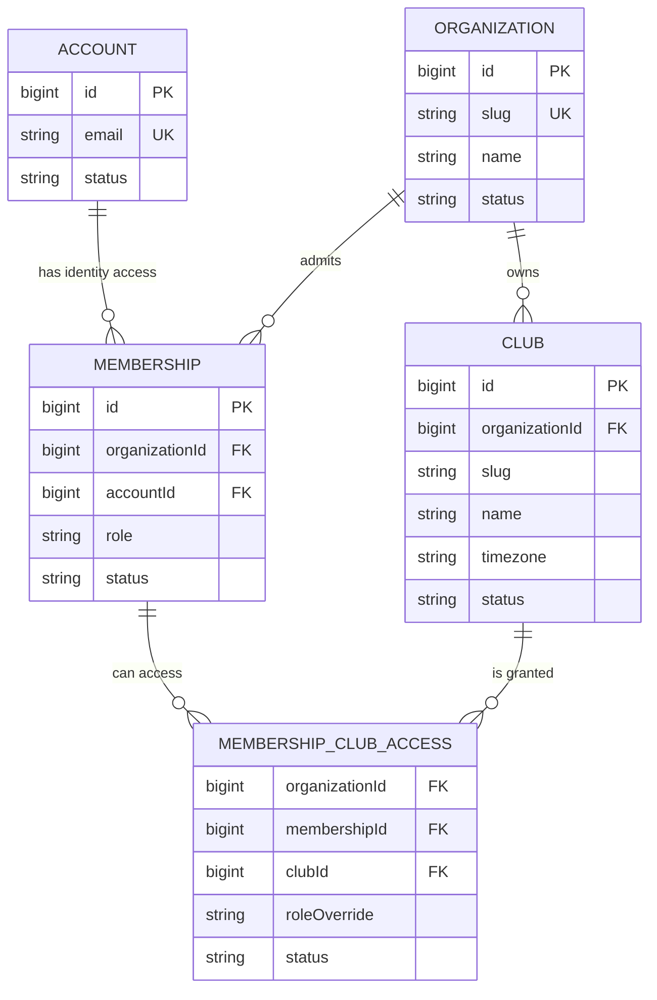

# Multi-tenant architecture v1: Organization → Clubs → Memberships

Статус: `accepted for implementation planning — QA green`

Promotion result: повторный независимый QA завершен со статусом `ready for SaaS integration`; P0–P3 findings отсутствуют. Feature 1 принят для implementation planning.

Дата: 2026-07-14

Ревизия: `1.3 — fresh install and Account writer contract`

Срез: Feature 1 — inventory и архитектурное решение

Связанный inventory: [`TENANT_INVENTORY_V1.md`](./TENANT_INVENTORY_V1.md)

## 1. Решение

Setly переходит от неявной модели «одна установка = один клуб» к shared-schema multi-tenancy:

- глобальная identity пользователя хранится отдельно от его доступа к бизнес-данным;
- `Organization` объединяет один или несколько `Club`;
- `Membership` связывает глобальный `Account` с организацией и задает базовую роль;
- `MembershipClubAccess` задает разрешенные клубы и при необходимости role override;
- текущий Padel Park backfill-ится как одна организация и один клуб без изменения текущего UX;
- все бизнес-запросы получают проверенный tenant context до обращения к данным;
- SaaS-тарифы, подписка на Setly, usage billing и SaaS invoices в эту архитектуру не входят.

Новые сущности следующего среза:



### DB-enforceable foundation schema

Feature 2 использует один явный `organizationId` в `MembershipClubAccess` и два composite FK. Это не application-only validation: строка access физически не сможет связать membership одной организации с club другой.

| Table | Keys, constraints and required indexes |
| --- | --- |
| `Organizations` | PK `(id)`; global unique `(slug)`; `status ENUM('active','inactive','archived') NOT NULL`; default row slug `padel-park`. |
| `Clubs` | PK `(id)`; `organizationId NOT NULL` FK → `Organizations(id)` `ON DELETE RESTRICT`; `status ENUM('active','inactive','archived') NOT NULL`; unique `(organizationId, slug)`; additional unique `(organizationId, id)` as referenced composite key; index `(organizationId, status, id)`. Default row slug `padel-park`. |
| `Memberships` | PK `(id)`; `organizationId NOT NULL` FK → `Organizations(id)` `ON DELETE RESTRICT`; `accountId NOT NULL` FK → `Accounts(id)` `ON DELETE RESTRICT`; `role ENUM('owner','manager','admin','accountant','viewer','trainer') NOT NULL`; `status ENUM('active','inactive','archived') NOT NULL`; unique `(organizationId, accountId)`; additional unique `(organizationId, id)` as referenced composite key; indexes `(accountId, status, organizationId)` and `(organizationId, role, status)` for discovery and last-owner checks. |
| `MembershipClubAccesses` | Columns `organizationId`, `membershipId`, `clubId` are `NOT NULL`; `roleOverride ENUM('manager','admin','accountant','viewer','trainer') NULL` — `owner` отсутствует в DB enum; `status ENUM('active','inactive','archived') NOT NULL`; PK `(membershipId, clubId)`; FK `(organizationId, membershipId)` → `Memberships(organizationId, id)` `ON DELETE RESTRICT`; FK `(organizationId, clubId)` → `Clubs(organizationId, id)` `ON DELETE RESTRICT`; indexes `(organizationId, membershipId)` and `(organizationId, clubId, status)`. |

Referenced composite keys `(organizationId, id)` намеренно объявлены unique, даже несмотря на global PK `id`: так MySQL FK contract не зависит от permissive non-unique referenced-index behavior. Все tenant records архивируются/status-disable, а не удаляются cascade.

`Account.email` остается global unique: один login может состоять в нескольких организациях. `Account.role` остается compatibility-полем до переключения auth source.

`Membership.staffId` **не входит в Feature 2**. До Staff/access wave существующий `Account.staffId` остается compatibility link. В Feature 5 сначала добавляются и backfill-ятся `Staff.organizationId`, unique `(organizationId, id)` и tenant indexes; только затем в `Membership` добавляется nullable `staffId`, composite FK `(organizationId, staffId) → Staff(organizationId, id)` и unique `(organizationId, staffId)`. Обычный MySQL unique допускает несколько `NULL`, поэтому отдельный partial index не нужен.

## 2. Scope данных

### Global platform data

- `Account` как credential/identity;
- `SequelizeMeta`, OpenAPI schema, role/permission definitions и onboarding catalog как versioned platform metadata;
- общие технические конфигурации, не содержащие customer data.

Global не означает «доступно всем tenant». Это означает только отсутствие владельца-организации у самой записи.

### Organization-scoped

- профиль клиента (`User`) и его canonical merge-chain;
- сотрудник (`Staff`);
- общие справочники источников клиентов, целей визита и P&L taxonomy;
- методическая база навыков и упражнений;
- общий skill map клиента;
- шаблоны отчетов смены;
- политики мотивации и payroll period, если они управляются централизованно;
- продуктовые типы абонементов как общее определение организации; доступность/цена по клубам должна быть отдельной настройкой, если понадобится.

### Club-scoped

- визиты, scanner events и выдача ключей;
- корты, расписание, брони, серии, блокировки, тарифы и исключения;
- training notes и training plans как факт работы конкретного клуба;
- смены, отчеты смены и вложения;
- финоперации, чеки Эвотора, catalog mappings и pending sales;
- телефония, Beeline subscriptions/raw events, recordings, transcription jobs;
- операционные client bases/call tasks/saved views;
- utilization и club-level exports/analytics.

### Membership/access

- `Membership`, `MembershipClubAccess` и effective role;
- onboarding progress принадлежит membership, а training mode дополнительно фиксирует выбранный клуб;
- selected organization/club является предпочтением интерфейса, но не источником авторизации.

### Отдельное бизнес-решение до enforcement

- абонементы и сертификаты: действуют только в клубе продажи или во всех клубах организации;
- корпоративный баланс: единый по организации или отдельный по клубам;
- payroll/motivation: единый расчет организации или отдельные периоды/правила клубов;
- telephony client ownership: звонок всегда относится к номеру конкретного клуба, даже если клиент organization-wide;
- перенос/merge клиента между организациями запрещен; merge внутри организации разрешен.

До решения по предоплатам безопасный default — хранить `originClubId`, не разрешать cross-club redemption и не агрегировать liability между клубами.

## 3. Tenant context

### HTTP

После `requireAuth` отдельный resolver обязан построить:

```ts
type TenantContext = {
  accountId: number;
  membershipId: number | null;
  organizationId: number | null;
  clubId: number | null;
  membershipRole: AccountRole | null;
  effectiveRole: AccountRole | null;
  scope: 'global' | 'organization' | 'club' | 'membership';
};
```

Токен содержит стабильный `accountId` и session/version metadata, но не является долгоживущим доказательством доступа к tenant. Каждый endpoint декларирует один scope; обязательный transport contract:

| Endpoint scope | Required headers | Как определяется membership и роль |
| --- | --- | --- |
| `global` | tenant headers не нужны | Только allowlisted auth/discovery/health/platform metadata. Global endpoint не читает business rows. |
| `membership` | `X-Organization-Id` | Resolver требует active Account, Organization и Membership по `accountId + organizationId`; client-supplied `membershipId` не является authority. Self-progress/preferences разрешаются внутри этой Membership. |
| `organization` | `X-Organization-Id` | Resolver требует active Account, Organization и Membership. Authorization использует только `Membership.role`; club `roleOverride` никогда не влияет на organization endpoint. |
| `club` | `X-Organization-Id` и `X-Club-Id` | Resolver требует active Account/Organization/Membership/Club и active access row для non-owner. Authorization использует `effectiveRole`. |

Дополнительные правила:

1. Явные headers обязательны на **каждом** organization/club request, включая single-club Padel Park. Их отсутствие дает `400 TENANT_CONTEXT_REQUIRED`; server не подставляет сохраненный context.
2. Server-side last-selected context — только preference/default, который помогает UI выбрать значения и сформировать headers. Он не является authority и не заменяет ни header, ни повторную membership/access проверку.
3. Если доступен один club, frontend автоматически ставит оба headers и скрывает switcher; это сохраняет UX без implicit server fallback.
4. `organizationId`/`clubId` из body, query, saved preference или JWT не используется как authority. Create берет tenant только из проверенного `req.tenant`.
5. `X-Club-Id` обязан принадлежать `X-Organization-Id`; mismatch отклоняется до controller. Недоступный tenant возвращает единообразный `404` или `403` без раскрытия существования.
6. Lookup выполняется как `id + tenant predicate` либо через уже tenant-scoped parent. Один `findByPk(id)` для business entity недопустим.
7. Raw SQL/CTE получает обязательные tenant replacements и фильтрует каждую корневую таблицу до join/aggregation.

Membership-scoped endpoints обслуживают только ресурс текущего authenticated membership: onboarding progress, membership preferences и last-selected context. Global `/auth/me/memberships` может вернуть минимальный список доступных organizations для bootstrap без tenant header. Просмотр/изменение **чужого** membership — organization-scoped administrative endpoint: path `membershipId` всегда ищется вместе с `X-Organization-Id`, а права проверяются по actor `Membership.role`. Любой membership resource с club-bound data становится club-scoped и требует оба headers.

### Roles и owner

- базовая роль находится в `Membership.role`;
- `MembershipClubAccess.roleOverride` применяется только внутри конкретного клуба и не может быть `owner`; значение исключено из DB enum и application validation enum;
- effective role = `owner`, если membership role `owner`, иначе `roleOverride ?? membership.role`;
- organization endpoints проверяют `Membership.role`; club endpoints проверяют `effectiveRole`;
- owner видит все текущие и будущие clubs своей organization, даже без отдельных access rows;
- owner не получает доступ к другой organization;
- обязательная active chain для organization request: `Account.status = active`, `Organization.status = active`, `Membership.status = active`;
- для club request дополнительно обязательны `Club.status = active` и, если Membership не owner, `MembershipClubAccess.status = active`; inactive/archived rows никогда не дают доступ;
- после bootstrap в каждой Organization, независимо от ее собственного status, должен оставаться минимум один active Membership с role `owner`; единственное исключение — формальный bootstrap-pending state с одновременно пустыми Accounts/Memberships/Accesses;
- platform support/admin, если когда-либо появится, должен быть отдельным явно audited механизмом и не использовать CRM role `owner`.

После bootstrap последнего active owner нельзя удалить, архивировать, деактивировать или понизить. Обычный FK/unique не выражает count invariant, поэтому mutation transaction блокирует строку Organization и ее active owner memberships через `SELECT ... FOR UPDATE`, повторно считает owners и отклоняет результат `< 1`. Тот же guard обязателен для bulk/admin/migration paths; startup/release assertion проверяет invariant независимо от application service. Feature 2 содержит concurrency tests двух одновременных demotion/deactivation attempts.

### Feature 2 fresh-install / bootstrap-pending contract

Feature 2 foundation имеет ровно два допустимых operational states и один invalid state:

| State | DB condition | Startup behavior |
| --- | --- | --- |
| `bootstrap-pending` | Exact active default Organization/Club `padel-park`/`padel-park` уже существуют; `Accounts.count = Memberships.count = MembershipClubAccesses.count = 0`. Active owner пока не требуется. | Операционно разрешены только `GET /api/health`, `GET /api/auth/status` и `POST /api/auth/bootstrap`. Health/status явно возвращают `bootstrapPending: true`. Bare legacy `POST /api/integrations/beeline/events` не является allowlisted traffic: он безусловно отклоняется opaque `404` раньше parser и bootstrap gate. |
| `initialized` | Exact default tenant существует; Account/Membership/access parity выполнена; минимум один active owner Membership. | Включается strict startup assertion, обычный API и разрешенные background components. До Feature 3 auth/read source остается Account. |
| `invalid` | Любая частично пустая тройка, orphan, parity mismatch, второй tenant или неполный initial owner. | Fail-closed: business traffic, bootstrap repair, bots, webhooks, workers и runners запрещены; startup/release сообщает диагностическую ошибку и требует operator recovery. |

Feature 2 migration всегда создает exact default Organization/Club. При `Accounts.count = 0` она успешно завершается в `bootstrap-pending`, не создает Membership/access и не требует active owner. При Accounts > 0 она делает обычный backfill и обязана завершиться только в `initialized`.

Текущий `auth.service.isSetupRequired()` больше не может проверять только `Account.count`. Он использует общий state classifier: возвращает `true` исключительно для exact bootstrap-pending, `false` для initialized и бросает fail-closed diagnostic для invalid/partial state.

Bootstrap gate стоит раньше `/openapi.json`, current connection-first webhooks, transcription-worker routes, `requireAuth` и любых business routers. В `bootstrap-pending` login и любой запрос, дошедший до gate, кроме трех allowlisted возвращает `503 BOOTSTRAP_REQUIRED`; current provider ingress также остается fail-closed. Единственное более раннее исключение — bare legacy `POST /api/integrations/beeline/events`: route ordering сохраняет его provider-ingress classification, но безусловно возвращает opaque `404` до body parser, записи события и bootstrap gate. `server/bot.js`, Telegram/VK bots, recurring call-task runner и Beeline subscription runner не стартуют; worker claim/webhook ingress также закрыты. Каждый API/bot/runner process использует один state assertion и повторно проверяет его перед переходом в initialized mode.

`POST /api/auth/bootstrap` выполняет одну DB transaction:

1. `SELECT ... FOR UPDATE` exact default Organization и проверяет связанный default Club.
2. После lock повторно требует `Accounts = Memberships = MembershipClubAccesses = 0`; partial state не repair-ится.
3. Создает active `Staff`, active owner `Account` и active owner `Membership` default Organization. Owner access не создается.
4. Внутри transaction проверяет projected strict parity и ровно одного initial active owner, затем commits. Session/token создается только после commit.
5. После commit API повторно запускает strict assertion перед открытием business traffic; idempotent background start path запускается только после такого же assertion. Отдельный bot/runner process остается blocked, пока его собственная проверка не увидит initialized state.

Organization row lock является bootstrap concurrency guard. Два параллельных bootstrap request сериализуются: победитель создает initial owner, второй после lock видит непустую тройку и получает `409 ALREADY_BOOTSTRAPPED`; два initial owner невозможны. Любая forced ошибка при создании Staff/Account/Membership откатывает все три строки и оставляет исходный bootstrap-pending state.

После successful bootstrap переход назад в bootstrap-pending через обычные Account mutations запрещен last-active-owner guard. Demo seeders не являются bootstrap mechanism и не запускаются в pending state.

### Feature 2 compatibility lifecycle bridge

Feature 2 меняет только **write lifecycle** Account, чтобы additive foundation не расходился с текущей identity model. Все Account-based reads, JWT payload, `requireAuth`, `requireRole`, permissions и login decisions продолжают использовать `Account.role/status/staffId` до Feature 3. Membership в Feature 2 является synchronized shadow/access foundation, а не новым auth source.

Account writer разделен на два закрытых entry point; произвольный объект update не допускается:

| Writer | Allowed mutations | Transaction/locks |
| --- | --- | --- |
| Full lifecycle bridge | Account create; любое изменение `role` или `status`; archive, restore, permanent delete; любой mixed payload, где вместе с metadata присутствует parity-affecting field | Одна transaction. Lock order: default Organization → target Account/Membership → access rows. Owner guard и Account/Membership/access writes выполняются под тем же Organization lock. |
| Metadata writer | Только allowlist `lastLoginAt`, `email`, `passwordHash`, `staffId`; в Feature 2 эти поля не копируются в Membership. | Централизованный writer валидирует exact field allowlist, блокирует target Account row и пишет в transaction без organization-wide lock. Payload с `role`/`status` отклоняется/маршрутизируется в full bridge. |

`staffId` является metadata-only только до Feature 5, потому `Membership.staffId` еще не существует. Staff/access wave обязана пересмотреть writer classification одновременно с добавлением composite Membership→Staff link.

Обязательный inventory существующих writer paths:

- `server/src/services/accounts.service.js`: `create`, role/status `update`, `remove` (archive), `restore`, `removeArchived` используют full bridge; update только `email/password/staffId` использует metadata writer; mixed update использует full bridge;
- `server/src/services/auth.service.js`: `bootstrapOwner` использует отдельный bootstrap transaction с Organization lock; прямые `Staff.create`/`Account.create` удаляются из этого path;
- `server/src/services/auth.service.js`: login update `lastLoginAt` использует metadata writer без Organization lock; login/auth decisions остаются Account-based;
- `server/scripts/seed-demo-accounts.js`: вся upsert-пачка выполняется через lifecycle batch adapter в одной transaction под одним Organization lock;
- `server/seeders/20260511120000-demo-crm-data.js`: и `up`, и `down` используют explicit batch transaction и lifecycle-aware seeder adapter.

Для `seed-demo-accounts.js` Staff создаются/upsert-ятся перед Account lifecycle upsert; projected final state проверяется до commit. Script не имеет `down`, не считается bootstrap и требует initialized state. Для `demo-crm-data` cleanup в `up` и удаление в `down` идут строго `MembershipClubAccesses → Memberships → Accounts → Staffs`; создание идет `Staffs → Accounts → Memberships → non-owner Accesses`. Batch owner guard под Organization lock проверяет **projected final state**, поэтому replacement demo owner допустим атомарно, но `down` откатывается, если после удаления не останется active owner. Seeder up/down запрещены в bootstrap-pending и не могут создавать initial owner вместо `/auth/bootstrap`.

Прямые production writes запрещены. Feature 2 добавляет repository audit по `server/src`, `server/scripts` и `server/seeders`, который находит `Account.create/update/destroy`, Account instance `update/destroy` и `bulkInsert/bulkUpdate/bulkDelete('Accounts')`. Allowlist содержит только lifecycle/metadata writers и dedicated seeder adapter; historical migrations не переписываются. Любая новая точка записи ломает test/release gate. Startup parity assertion ничего не чинит молча: divergence останавливает startup/release.

| Account mutation | Атомарные действия Feature 2 |
| --- | --- |
| Create | Создать Account и default Membership с одинаковыми `role/status`. Если role не `owner`, создать ровно один default Club access с тем же status и `roleOverride = NULL`; для owner access не создавать. Любой failure откатывает Account, Membership и access вместе. |
| Role/status update | Под lock вычислить final pair `role/status`, выполнить last-active-owner guard, затем обновить Account и Membership одинаковыми значениями. Для non-owner access status всегда равен Membership status и `roleOverride` остается `NULL` в single-default bridge. |
| `owner → non-owner` | После owner guard создать/upsert default access с final Membership status; transition role+status обрабатывается как одна операция. |
| `non-owner → owner` | После owner guard удалить default access, затем записать owner role в Account/Membership; owner не зависит от access rows. |
| Archive | Текущий soft-delete contract сохраняется: Account и Membership получают `archived`; non-owner access получает `archived`, owner access отсутствует. |
| Restore | Account и Membership получают `active`; non-owner default access создается при отсутствии и получает `active`, owner access удаляется/остается отсутствующим. |
| Inactivate/reactivate | Account/Membership status синхронны; non-owner access получает тот же status, owner access отсутствует. |
| Permanent delete | Текущий `DELETE /accounts/:id/permanent` product contract сохраняется: только archived Account, не self, после существующих dependency checks. В одной transaction и под теми же locks выполнить last-owner guard, удалить `MembershipClubAccesses`, затем `Membership`, затем `Account`; FK `RESTRICT` остается финальной защитой от забытых references. Частичное удаление запрещено. |

После **каждой** успешной обычной Account mutation должны выполняться parity invariants:

1. Для каждого Account существует ровно одна Membership default Organization; `Account.role = Membership.role` и `Account.status = Membership.status`.
2. У owner Membership нет access rows. У non-owner есть ровно один access к default Club, `access.status = membership.status`, `roleOverride IS NULL`.
3. Нет Membership без Account, access без Membership/Club или строк вне exact default tenant.
4. В Organization остается минимум один active owner Membership; guard использует уже вычисленные final role/status.
5. Hard single-default assertion и Feature 2 rollback preflight продолжают проходить без repair/backfill после create, update, archive, restore, role transition и permanent delete.

Feature 2 получает DB-backed lifecycle tests:

- empty database migration создает exact default Organization/Club, оставляет Accounts/Memberships/Accesses пустыми и входит в bootstrap-pending без active-owner failure;
- bootstrap transaction создает Staff+Account+owner Membership без access; forced failure на каждом insert откатывает все rows; после success включается strict parity assertion;
- два concurrent bootstrap request на разных DB connections дают один success, один `409 ALREADY_BOOTSTRAPPED` и ровно одного initial owner;
- create для owner и non-owner во всех `active/inactive/archived` status, включая forced failure/rollback без partial rows;
- status transitions, archive/restore и combined role+status update;
- `owner → non-owner` создает access, `non-owner → owner` удаляет access;
- permanent delete проверяет order access → membership → Account, dependency rejection и atomic rollback;
- login обновляет `lastLoginAt` через metadata writer без Organization lock и не меняет Membership/access parity; email/passwordHash/staffId allowlist и mixed-update dispatch проверяются отдельно;
- `seed-demo-accounts.js` batch upsert и `demo-crm-data` seeder `up/down` проходят в initialized DB одной transaction, соблюдают delete order access → membership → Account и оставляют parity/active owner; forced batch failure полностью откатывается;
- repository direct-Account-write audit проходит на текущем writer allowlist и намеренно падает на synthetic unauthorized create/update/delete/bulk write;
- Account-based auth/read responses до и после bridge идентичны baseline Feature 1;
- startup/release/rollback parity assertion проходит после последовательности обычных mutations и fail-closed на искусственном divergence;
- concurrency: две параллельные demotion/deactivation/archive или combined role+status mutations не могут убрать последнего active owner; тест использует отдельные DB transactions/connections при общем project test command `server npm test` с `--test-concurrency=1` для DB-backed suite.

### Переключение клуба

- `/auth/me` или отдельный context endpoint возвращает memberships, доступные clubs и last-selected context;
- switch сохраняет preference сервером/локально, затем обновляет HTTP headers/socket subscription;
- перед показом данных frontend очищает или разделяет tenant-sensitive query cache;
- URL с entity ID из другого клуба возвращает `404` (предпочтительно для сокрытия существования) или единообразный `403`, но никогда не переключает context автоматически;
- если доступен ровно один клуб, switcher не показывается.

### Realtime / Socket.IO

Текущие role-only rooms (`crm:domain:*`) небезопасны для второго tenant. Целевые rooms:

- `org:{organizationId}` для organization-wide событий;
- `club:{clubId}:domain:{domain}` для club events;
- `membership:{membershipId}` для private progress/context events.

Socket handshake повторно загружает memberships, разрешает только доступные rooms и удаляет subscription после revoke. Event содержит `organizationId`, nullable `clubId`, `domain`, `entity`, `entityId`, но не содержит customer payload. Клиент игнорирует event, не совпадающий с активным context.

### Workers и background jobs

- job хранит или однозначно наследует tenant; claim возвращает tenant context вместе с job;
- worker credential имеет allowlist организаций/клубов либо явно объявленный audited platform-worker scope;
- claim/update/result используют `(jobId, tenant)` и не принимают tenant только со слов worker;
- advisory/distributed locks включают organization/club ID;
- recurring call tasks и Beeline subscription runner итерируют clubs отдельно, логируют tenant и не используют глобальный singleton config;
- временные аудиофайлы включают opaque tenant namespace; PII не попадает в имена файлов/логи;
- ASR/LLM получают минимальный payload, а CRM сохраняет tenant и исходные speaker/timestamps вне LLM response.

## 4. Isolation по инфраструктурным поверхностям

### Files/uploads

Целевой layout:

```text
<storage-root>/<organization-uuid>/<club-uuid>/<domain>/<record-uuid>/<file-uuid>
```

DB metadata содержит organization/club; download сначала проверяет tenant-scoped record, затем открывает файл. Нельзя строить authorization только по пути или sequential `reportId`. Backup/restore должен включать DB и tenant-partitioned uploads одним consistency boundary.

### Exports

- export использует тот же scoped query/service, что экран;
- filename не является защитой; workbook metadata/manifest фиксирует organization, club, period и generatedAt;
- platform-wide export запрещен обычным CRM role;
- background export job наследует tenant immutable;
- временные export-файлы удаляются и не лежат в общем public directory.

### Cache/query keys

- Redis prefix: `setly:{organizationId}:{clubId|org}:{domain}:...`;
- invalidation ограничена tenant prefix;
- frontend query keys начинаются с `['tenant', organizationId, clubId, ...]`;
- при switch нельзя повторно показывать cached data предыдущего клуба даже как placeholder;
- health cache stats могут быть global aggregate, но debug keys/payload не отдаются tenant users.

### Webhooks/integrations

- credential/secret или отдельный opaque integration ID сначала разрешается в `IntegrationConnection(organizationId, clubId, provider)`;
- только после этого payload обрабатывается и idempotency key вычисляется внутри tenant;
- Evotor: unique `(clubId, evotorId)`, sale settings/catalog mapping club-scoped;
- Beeline: unique `(clubId, provider, external*)`, per-club callback/subscription/config и tenant-scoped advisory lock;
- Telegram/VK bots: один bot token нельзя молча привязать к нескольким клубам; entry point/deep link/bot connection должен определить club до поиска/создания клиента;
- webhook без разрешенного tenant отклоняется и сохраняет только redacted platform diagnostic, не business row.

### Audit/onboarding/demo

- `AuditLog` сохраняет immutable `organizationId` и nullable exact `clubId` provenance для club-scoped request; actor snapshot — существующие `accountId` + effective `role`, без dormant `membershipId`. `FinanceChangeLog`, `BookingChangeLog`, raw events и scanner events сохраняют собственный immutable tenant snapshot по своим domain-контрактам;
- onboarding catalog global, progress membership-scoped, action events/training data club-scoped;
- training cleanup требует organization + club + membership/account, иначе возможна массовая cross-tenant deletion;
- до Feature 9 demo/performance/smoke fixtures создаются только в exact default organization/club; multi-tenant fixtures разрешены лишь в isolated ephemeral DB Feature 9;
- production seeders не используют глобальные `findOrCreate` по имени/email бизнес-сущности без tenant.

### Backups/restore

- текущий DB-only checklist недостаточен: нужны DB, uploads, integration config metadata и worker state policy;
- restore отдельной организации нельзя делать простым partial SQL import без remap PK/FK, tenant validation и object/file restore;
- первый production rollout требует full backup и restore rehearsal до включения scoped reads;
- каждая migration wave имеет row-count/checksum отчет по organization/club и orphan detector;
- удаление organization/club — отдельная retention/erasure процедура, не cascade из UI.

### Feature 9 final enforcement contract

- `TENANT_ENFORCEMENT_ENABLED` — внутренний server-owned capability поверх всех принятых tenant waves. Он не является production rollout flag и не разрешает provisioning или selected-club UX.
- Любой legacy flag-off bridge сначала подтверждает exact initialized singleton default: одна active default Organization, один active default Club, полная Account/Membership/access parity и отсутствие второго tenant. При второй Organization/Club business read/write/ingress/worker/realtime операция завершается `TENANT_SINGLE_DEFAULT_REQUIRED` до мутации.
- Additive migration `20260720100000-add-final-tenant-enforcement.js` не переписывает accepted history. Она выполняет data preflight, добавляет только доказанные composite FK/index/immutability guards для telephony/worker и foundation links, поддерживает reapply и отказывается от rollback, если tenant ownership будет потеряно.
- `tenant:integrity:detect` — общий read-only detector. Machine-readable report включает missing parent, wrong Organization/Club/Membership, provider/storage/session links, cross-tenant child/polymorphic links и unsupported ownership states. Repair/mutation mode намеренно отсутствует.
- `tenant:enforcement:audit` агрегирует существующие domain-specific direct ORM/raw/bulk/alias audits и route/file/worker inventory; он не заменяет и не ослабляет их.
- Ephemeral RC fixture содержит две Organizations, минимум два Clubs в каждой, шесть ролей и совпадающие natural identities. Fixture доступен только из tests и не является seeder/provisioning API/CLI.
- Installation restore rehearsal охватывает consistent DB dump, tenant storage и legacy upload roots, non-secret integration identity metadata, worker rebuild policy, checksums и detector. Restore разрешен только целиком в fresh isolated installation; tenant-selective restore остаётся unsupported.
- Воспроизводимый pre-main gate: из `server/` выполнить `npm run tenant:rc -- --output=/private/tmp/setly-f9-rc-<id>`. Команда отказывается от `NODE_ENV=production`, production-like `DB_NAME` и небезопасного output path, создаёт isolated DB/storage names и очищает временную инфраструктуру в `finally`.

### Feature 10.3 production rollout contract

- Канонический staged cutover, historical singleton preservation evidence, maintenance barrier, rollback и second-tenant boundary описаны в [`MULTI_TENANCY_PRODUCTION_ROLLOUT_V10_3.md`](./MULTI_TENANCY_PRODUCTION_ROLLOUT_V10_3.md).
- Production migration должна доказать unchanged counts, primary-key sets и
  значения всех существовавших до migrations колонок прежних business tables
  до открытия трафика; default tenant control rows проверяются отдельно exact
  foundation/integrity gates.
- Capability flags включаются только dependency prefix. Runtime rollback возвращает предыдущий green prefix и не удаляет additive tenant attribution.
- Второй production tenant запрещён до final Feature 10.3 stage, permanent SaaS QA и отдельного production authorization.

## 5. Cross-tenant invariants

1. Каждая новая модель, endpoint, event, job, cache key, file и export явно декларирует scope: `global | organization | club | membership`.
2. Business row без выводимого tenant запрещен. Для aggregate root tenant ID обязателен; child может наследовать tenant через non-null parent FK.
3. Денормализованный tenant ID разрешен только для ingress, audit, queue/routing, partitioning или доказанной производительности; он проверяется на совпадение с parent.
4. Все unique/index constraints, которые описывают business identity, включают tenant либо опираются на tenant-scoped parent key.
5. FK между organization-scoped и club-scoped данными обязан проверять, что `club.organizationId` совпадает с organization owner записи.
6. Нельзя использовать client-supplied tenant ID без membership check.
7. Нельзя возвращать данные другой организации через error detail, autocomplete, count, metrics, export, log, realtime event или cache.
8. Изоляционные тесты используют минимум две organizations, одинаковые natural keys и пользователя с разными ролями/club access; до Feature 9 это разрешено только в isolated ephemeral test DB.
9. Cross-organization join запрещен по умолчанию. Разрешение требует отдельного ADR и platform-level authorization.
10. SaaS billing entities (`SaasPlan`, `OrganizationSubscription`, `UsageRecord`, SaaS `Invoice`) не создаются в этом эпике.
11. До final acceptance Feature 10.3 и отдельного production authorization production schema содержит ровно default Organization и default Club; provisioning второго tenant запрещен.
12. Organization/club request без обязательных explicit tenant headers отклоняется, даже если server хранит last-selected context.
13. После bootstrap ни одна Organization, включая inactive/archived, не может остаться без active owner Membership. До bootstrap допустима только полностью пустая тройка Accounts/Memberships/MembershipClubAccesses.

## 6. Backfill Padel Park

Общий порядок для будущих migrations (в этом Feature 1 migrations нет):

1. Создать единственный `Organization(name = 'Padel Park', slug = 'padel-park', status = 'active')` и единственный принадлежащий ему `Club(name = 'Padel Park', slug = 'padel-park', status = 'active')`. Константы slugs: `DEFAULT_ORGANIZATION_SLUG=padel-park`, `DEFAULT_CLUB_SLUG=padel-park`; migration aborts, если такой slug уже занят несовместимой строкой.
2. Создать ровно один `Membership` для каждого существующего `Account`, включая inactive/archived: `organizationId = default`, `role = Account.role`, `status = Account.status`. `Accounts.count = 0` — валидный fresh-install result: migration не создает identity rows и не падает. Если Accounts не пусты, перед завершением обязан существовать минимум один `active owner`; иначе migration aborts.
3. Для каждого non-owner Membership создать ровно один access row к default Club со status, равным Membership status: active → active, inactive → inactive, archived → archived. Для owner access row не создается; active owner получает все clubs по invariant, inactive/archived owner доступа не имеет из-за active chain. `Account.role/status/staffId` остаются неизменными compatibility fields.
4. Добавлять tenant columns только nullable, backfill-ить корневые таблицы default organization/club, валидировать row counts и orphan paths.
5. Backfill children через parent. Если parent path неоднозначен или отсутствует — остановить migration и записать exception, не назначать tenant по догадке.
6. Добавить dual-write и shadow assertions; старые reads остаются до проверки.
7. Перестроить global unique indexes в tenant-aware только после duplicate preflight.
8. Включить scoped reads domain wave за feature flag; сравнить counts/exports с baseline первого клуба.
9. После QA сделать tenant columns `NOT NULL`, включить cross-tenant guards и только затем удалить compatibility role/context paths.

### Feature 2 rollback preflight

`down` выполняет **все** проверки до первого `DROP`; при одном failure rollback aborts без частичного удаления:

1. В `Organizations` ровно одна строка: active slug `padel-park`. В `Clubs` ровно одна строка: active slug `padel-park`, связанная с этой Organization.
2. Под locks читаются counts Accounts/Memberships/Accesses. Если все три равны нулю, выбирается bootstrap-pending branch. Если пусты только одна/две таблицы или counts не могут образовать parity — rollback aborts. Если Accounts > 0, выбирается initialized branch.
3. Bootstrap-pending branch разрешен **только** при повторно подтвержденном `Accounts = Memberships = Accesses = 0`; active owner не требуется. Initialized branch требует `Memberships.count = Accounts.count`, ровно одну default Membership на Account, exact `role/status` parity и минимум одного active owner.
4. В pending branch access остается пустым. В initialized branch каждый non-owner имеет ровно один default access с тем же status/`roleOverride IS NULL`, owner access отсутствует, дополнительных/mismatched rows нет.
5. `INFORMATION_SCHEMA` не содержит FK из других tables на foundation tables или tenant columns вне них, а `SequelizeMeta` не содержит exact allowlist migrations Features 3–9. Это запрещает rollback после последующей tenant wave; prefix/date guessing запрещен.
6. Compatibility `Accounts.role/status/staffId` существуют и не были изменены/удалены; state classification, row-count и checksum preflight сохранены в rollback output.

После успешного preflight drop order только такой: `MembershipClubAccesses → Memberships → Clubs → Organizations`. Rollback до bootstrap разрешен исключительно empty branch; любой partial initial owner блокирует rollback. Rollback не изменяет Accounts, Staff или business rows. Повторное применение migration обязано воспроизвести прежний state: bootstrap-pending при Accounts=0 либо initialized parity при Accounts>0.

Backfill order по зависимостям:

```text
Organization/Club/Membership
  → organization dictionaries (Staff, User, ClientSource, VisitCategory, Category, methodology)
  → club roots (Court, BookingSettings, Finance, Receipt, Visit, Shift, TelephonyCall)
  → operational roots (ClientBase, CallTask, TrainingNote/Plan, integrations)
  → child/ledger/history rows
  → audit/onboarding/cache/files/worker state
  → constraints and enforcement
```

## 7. Следующие feature-срезы

| Срез | Зависит от | Scope и merge point | Rollback |
| --- | --- | --- | --- |
| Feature 2 — tenant foundation + compatibility bridge | Feature 1 green re-review | Additive foundation; fresh-install/bootstrap-pending gate; atomic initial Staff+Account+owner Membership; split full-lifecycle vs metadata Account writers; demo seeder batch parity; DB-backed lifecycle/bootstrap/concurrency/direct-write-audit tests; state-aware startup/migration/release assertion. No Membership.staffId; Account reads/auth unchanged. | `down` только после state-aware exact six-step preflight; empty pre-bootstrap rollback разрешен, partial bootstrap запрещен. |
| Feature 3 — context plumbing | Feature 2 | `req.tenant`, mandatory explicit header contract, membership resolver, `/auth/me` discovery/preferences, endpoint scope declaration API, feature flag; без массовой фильтрации доменов. Merge при identical UI behavior для default club, но без implicit server context fallback. | Disable flag; старые services остаются источником поведения. |
| Feature 4 — isolation infrastructure | Features 2–3 | Tenant-aware realtime rooms, Redis/query keys, files, worker claim, integration connections, per-tenant locks. Merge до подключения второго club. | Отключить new fanout/cache/worker routing; новые columns остаются additive. |
| Feature 5 — CRM/Staff/access wave | Features 2–4 | `Staff.organizationId` backfill и затем Membership.staffId composite FK; Users/clients, references, visits/scanner, client bases/call tasks; expand → backfill → dual-write → scoped reads → constraints. | Per-domain read flag назад; Account.staffId compatibility и dual-written tenant data сохраняются. |
| Feature 6 — bookings/training wave | Feature 5 org client identity | Courts/settings/bookings/series, training notes/plans, methodology/skill map; cross-parent checks. | Per-domain read flag; не откатывать committed business rows. |
| Feature 7 — finance/prepayments wave | Feature 5 + решения liability scope | Evotor/catalog/finance/payroll/prepayments/certificates/corporate; tenant-aware exports and reconciliation. | Отключить scoped reads/ingress по provider connection; сохранить tenant attribution. |
| Feature 8 — ops/audit/onboarding | Features 5–7 | Shifts/reports/uploads, audit logs, onboarding/training cleanup, default-tenant demo fixtures and backups. | Per-surface flags; attachment layout поддерживает dual-read до copy verification. |
| Feature 9 — enforcement and two-tenant QA | Features 4–8 | `NOT NULL`, composite uniques, orphan/cross-tenant detectors, ephemeral two-org isolation suite, restore drill. Второй tenant разрешен только в isolated test DB до acceptance. | Roll back constraints, не tenant attribution; production остается pinned к default tenant при failure. |
| Feature 10 — club switch UX/rollout | Feature 9 accepted | Только после снятия single-default gate: controlled provisioning contract/UI, switcher, selected preference, owner all-club UX, staged production enablement. | Отключить provisioning/switcher и pin default club; data model остается multi-tenant. |

### Feature 3 decision — mixed-scope frontend pages

Один page route не считается одно-scope только потому, что его основной URL относится к одному домену. Client authorization contract имеет три явных стратегии:

- `single`: page mount и все запросы используют один scope;
- `composite`: `RequireRoles` и sidebar проверяют все обязательные scope requirements до mount; при провале page code, initial queries и realtime subscriptions не монтируются;
- `partial`: основной scope монтирует страницу, а каждый optional cross-scope section/query/mutation имеет отдельный role guard по своему server `tenantScope`.

В Feature 3 composite contract выбран для текущих неразделимых flow: bookings (club schedule + organization client lookup), clients (organization registry + club saved views), trainer workspace (organization clients/methodology + club notes/plans), motivation, catalog, shift reports и finances. Эти страницы сейчас имеют общий loading/error/form state либо mount-time/realtime загрузки обеих сторон; показ только половины интерфейса создавал бы ложный рабочий flow. Поэтому отсутствие одной authority намеренно блокирует mount до будущего продуктового выделения независимых sections. Server permission matrix не расширяется.

Partial contract выбран для reception dashboard, call tasks, client bases, corporate clients, staff, onboarding и telephony: их cross-scope sections опциональны и могут быть безопасно отключены без потери основного flow. Запрещенный authority не запускает initial/background query, realtime refresh или mutation своего scope и не показывает ожидаемый `403` как UX-состояние.

При `TENANT_CONTEXT_ENABLED=false` каждое requirement использует legacy `Account.role`, поэтому default single-club visibility остается прежней. При включенном context membership/organization requirements используют `Membership.role`, club requirements — `effectiveRole`. Generated endpoint `tenantScope` и mixed-page dependency inventory проверяются автоматическим client audit.

### Hard rollout gate до Feature 9

- До полного acceptance Feature 9 нельзя создать вторую Organization или второй Club в production/staging data stores, кроме isolated ephemeral DB самой isolation suite.
- Features 2–8 не добавляют provisioning API, CLI, admin action или general-purpose organization/club seeder. Единственный разрешенный insert path — deterministic Feature 2 migration для slugs `padel-park`/`padel-park`.
- Feature 2 обязана добавить один state-aware assertion для post-migration, startup, release и rollback: exact default tenant обязателен всегда; полностью пустая identity/access triple означает bootstrap-pending; non-empty state требует полной Account/Membership/access parity и active owner; partial state invalid.
- До снятия gate assertion работает fail-closed. В bootstrap-pending разрешены только health/auth-status/bootstrap и отключены bots/runners/ingress; в invalid state migration/release останавливается и application не принимает business traffic.
- Feature 9 может создать второй tenant только test fixture в ephemeral DB. Production gate снимается отдельным release decision после green isolation suite, restore drill и QA; только Feature 10 получает право реализовать provisioning.

Параллельные обычные фичи продолжаются от актуального `main`. Требования на время эпика:

- каждый новый object/endpoint декларирует tenant scope в PR/handoff;
- migrations multi-tenant waves регулярно rebase на `main` и обновляют inventory для новых моделей;
- нельзя держать долгую mega-ветку со всеми доменами;
- каждый domain wave имеет отдельный merge point и feature flag;
- старый single-club behavior остается рабочим до Feature 9;
- конфликтующие migrations решаются добавлением новой forward migration, а не переписыванием уже merged history.

## 8. P0/P1 места смешивания при втором клубе

### P0 — блокируют добавление второго tenant

1. HTTP auth и permissions: token/account несут одну глобальную `role`; `requireRole` не проверяет organization/club, а services массово используют unscoped `findByPk/findAll`.
2. Raw SQL analytics: `clients.service.js`, `telephony.service.js`, особенно `visits-analytics.service.js` агрегируют таблицы без tenant predicate и экспортируют общий набор.
3. External ingress: один Evotor secret и global `Receipt.evotorId`; одна Beeline config/subscription и global provider external IDs; webhook не разрешает club до записи.
4. Training cleanup/onboarding: выборка по global account/role может удалить training data другого tenant после появления shared identity.
5. Files: shift-report attachments лежат в `server/var/shift-report-attachments/<reportId>`; tenant не входит в path/metadata authorization boundary.
6. Bots: Telegram/VK lookup по global external ID и единый список источников создают/обновляют клиента без organization/club context.

### P1 — серьезная утечка/порча или отказ в обслуживании

1. Socket.IO rooms разделены только по role/domain; tenant events будут fanout-иться всем одноименным ролям.
2. Redis keys `references:*`/`catalog:*` и frontend TanStack Query keys не содержат organization/club; switch может показать cached data другого клуба.
3. Worker token открывает глобальную transcription queue; jobs, progress и local SQLite dashboard state не содержат tenant partition.
4. Background runners обходят все recurring bases и единственную Beeline subscription; advisory lock name глобальный.
5. Global business uniques (`Court.name`, exception `date`, source/category/rule names, external IDs, certificate code и другие) либо блокируют легитимные данные второго tenant, либо заставляют ошибочно переиспользовать чужую запись.
6. Audit/FinanceChangeLog/ScannerEvent/raw payloads не имеют immutable tenant snapshot; расследование и безопасный export невозможны.
7. DB-only backup не включает shift-report uploads и не описывает tenant-selective restore; partial restore может смешать PK/FK.
8. Demo/performance seeders и smoke accounts используют глобальные natural keys и без tenant могут очистить/обновить записи другой организации.

Полная model-by-model детализация, tenant-aware indexes и backfill order находятся в [`TENANT_INVENTORY_V1.md`](./TENANT_INVENTORY_V1.md).

## 9. Сознательно нерешенные вопросы

1. Будут ли subscription/certificate balances переносимы между clubs одной organization.
2. Corporate balance и payroll period organization-wide или club-wide с organization consolidation.
3. Нужна ли manager organization-wide роль, отличная от manager отдельных clubs.
4. Клиентский consent/source: единый для organization или отдельный по club/channel.
5. Один Telegram/VK bot на organization или отдельный connection на club; как club выбирается до регистрации.
6. File/object storage target и RPO/RTO для uploads; текущий local disk не является долгосрочным multi-tenant storage решением.
7. Нужен ли отдельный staging tenant и как anonymize production-like fixtures.
8. Политика data retention/erasure для организации, звонков, транскрипций и audit logs.
9. Нужен ли owner consolidated «все клубы» read mode; он не должен подменять явный club context в мутациях.

Эти вопросы не блокируют Feature 2, если foundation остается additive и не меняет runtime queries.
